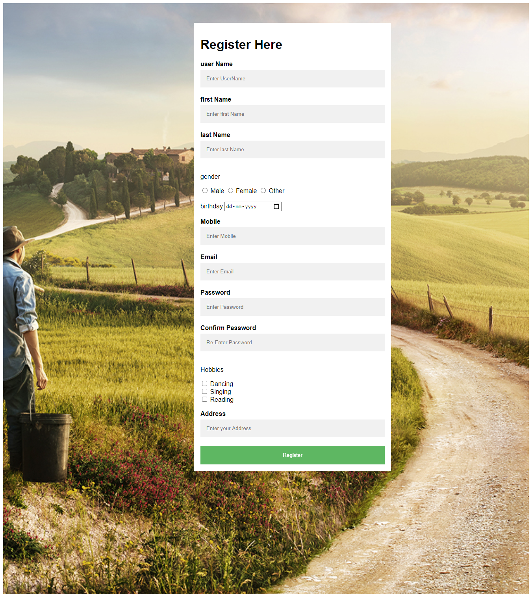

#Experiment 5

##Aim of the Experiment
Develop static pages (using Only HTML) of an online book store. The pages should resemble: www.amazon.com. The website should consists the following pages.
a) Home page
b) Registration and user Login
c) User Profile Page
d) Books catalog
e) Shopping Cart
f) Payment By credit card
g) Order Conformation 

###step by step procedure of experiment
1. Design a register Page
2.
3.

###Output

